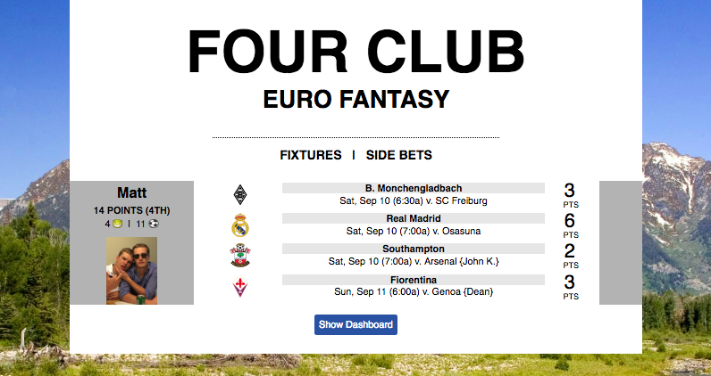
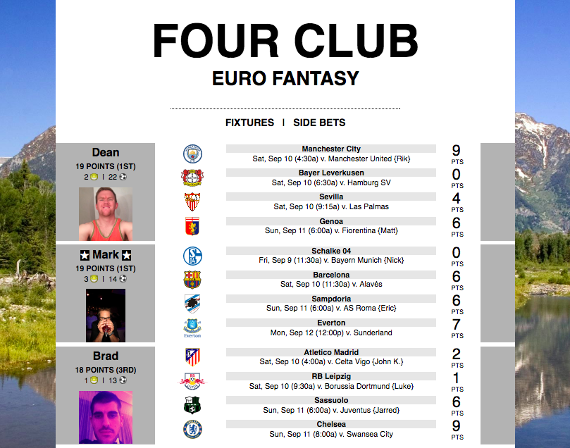
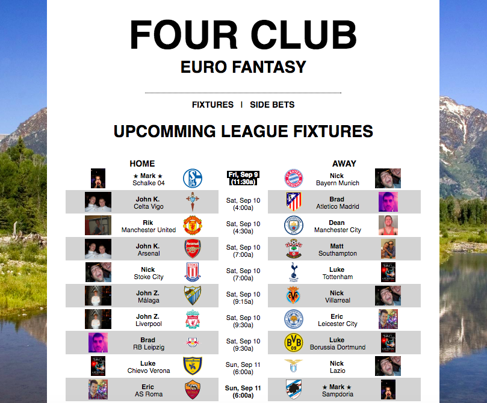
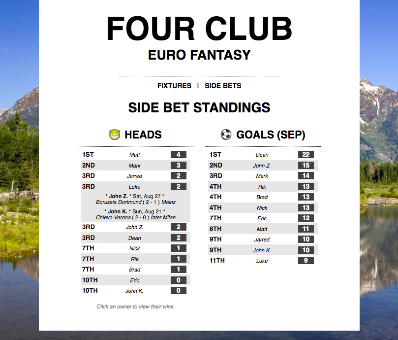

# Project Outline
*Four Club Euro Fantasy* is a fantasy gaming site that allows groups of friends to compete while expanding their knowledge of European soccer leagues. Check out the game [here](http://www.kor-league.herokuapp.com).

# Screenshot

# Game Structure
### Main Format
Each player selects one club from the first-division league in each of England, German, Spain, and Italy. Over the course of the season (August through May), points are accumulated in the standard international manner (3 points for a win, 1 point for a draw/tie, and 0 points for a loss). At the end of the season, the player with the most points between their four clubs is declared the winner.
### Side Games
In addition to the main format, various side games help to maintain interest along the way.
##### Goals
Each player accumulates a total of their clubs' goals scored throughout the month. At the end of the month, a winner is declared.
##### 'Heads'
Players win 'heads' when one of their clubs defeats a club owned by another player in the league. Along with the main format champion, a 'heads' champion is awarded at the end of the season.
##### Title Holder / Lineal Champion
At the start of the season, a 'title holder' is chosen by the league. This player maintains the 'title' until one of their clubs is defeated by a club owned by another player in the leauge. The owner of this winning club then becomes the title holder.
# Development
The features listed above are all live on the site, being used by a small group of real users. Once error-handling, testing, and scalability have reached stable levels, the competition can be expanded with trivial effort to allow for more leagues.
# Technologies
### Server-Side Framework and Database
*Four Club Euro Fantasy* is built on Ruby on Rails, using a PostgreSQL database.
### API
This project relies heavily on the [football-data.org](http://api.football-data.org/index) API for live scoring updates. The API is free to use, and has turned what could have been an expensive or scraper-instensive task into a pleasure.
### Libraries
- Ruby Gems

See the [full list](https://github.com/Andrelton/kor-league/blob/master/Gemfile).

*Note: No styling or Javascript-templating libraries (e.g. Bootstrap or Angular) were used in the design or implementation of this project.*

# Further Screenshots
### Main Page Features
All data is updated automatically by a Rake task that updates the database based on information retrieved from the football-data.org API. For each owner, clubs are listed in order according to the time of their next match. Times listed are approprate for the user's location (sent by the server but updated client-side with Javascript), and matches against other players in the league are noted. Points, goals, and 'heads' (as described above) totals are noted here. Further information on these formats can be found on the player's page and the 'Side Bets' page.

### Fixtures Page Features

Upcomming matches between clubs owned by players in the league are listed here. A match for the lineal title (as described above) is highlighted in black, while a *possible* such match is listed in bold.

### Side Bets Page Features

Here players are ranked by number of 'heads' (as described above) and goals in the current month. By clicking a player's name in the 'Heads' section, their name listing can by expanded to show when their 'heads' were won.

